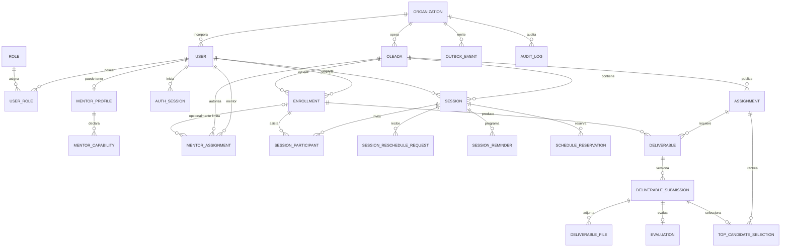

# 02 · Modelo de datos — baseline MVP

Versión 3 · 2026-07-25
Alcance: soporte operativo, Agenda/Sesiones, Entregables/Evaluaciones y eventos durables.

La unidad organizacional es EDU-US; una oleada es una cohorte. Job Search Tracking, mentoría par operativa, Demo Day, certificados e IA permanecen fuera del schema implementable del piloto.

## 1. Mapa de agregados



## 2. Identidad, organización y acceso

### `organization`

`id`, `name`, `slug`, `status`, timestamps.

Aunque el piloto inicia con una sola organización, esta tabla expresa la frontera correcta. Nunca se usa `oleada_id` como sustituto de tenant.

### `user`

`id`, `organization_id`, `email`, `normalized_email`, `password_hash`, `full_name`, `sector?`, `is_active`, `must_change_password`, `version`, timestamps.

- `normalized_email` guarda el email normalizado por service.
- `UNIQUE (organization_id, normalized_email)`, equivalente implementable a `lower(email)`.
- Desactivar no borra historial.
- No se almacenan tokens en texto plano.

### `role` y `user_role`

Roles base: `PARTICIPANT`, `MENTOR`, `ADMIN`.

- `UNIQUE (user_id, role_id)`.
- Un usuario puede tener varios roles.
- Un rol habilita una clase de operación; el ownership y las asignaciones limitan sobre qué registros puede ejecutarla.

### `mentor_profile`, `mentor_capability`, `mentor_assignment`

- `mentor_profile`: datos profesionales del mentor.
- `mentor_capability.kind`: `SPECIALIST` o `PEER`; admite ambas filas.
- `mentor_assignment`: `mentor_user_id`, `oleada_id`, `enrollment_id?`, `capability`, `starts_at`, `ends_at?`, `version`.
- `enrollment_id = null` autoriza alcance de cohorte; con valor limita al participante.
- El MVP usa `SPECIALIST`. `PEER` puede existir como capacidad, pero no activa el módulo futuro.

La API deriva `ACTIVE|CLOSED` de la vigencia; no existe un segundo estado mutable que pueda contradecir `ends_at`. Cerrar una asignación fija su fin, incrementa `version` y conserva auditoría.

### `auth_session`

`id`, `user_id`, `token_family_id`, `refresh_token_hash`, `expires_at`, `last_used_at`, `revoked_at?`, `replaced_by_id?`, metadata mínima.

La rotación invalida el secreto anterior. Detectar reuse revoca toda la familia. Logout, reset de contraseña o desactivación revocan las sesiones afectadas.

## 3. Programa

### `oleada`

`id`, `organization_id`, `name`, `sector`, `status`, `start_date`, `end_date`, `capacity`, `version`, timestamps.

Estados: `DRAFT`, `OPEN`, `IN_PROGRESS`, `CLOSED`.

### `enrollment`

`id`, `user_id`, `oleada_id`, `status`, `current_phase`, `current_week?`, `phase_1_graduated_at?`, `enrolled_at`, `version`, timestamps.

- `UNIQUE (user_id, oleada_id)`.
- Estado: `ACTIVE`, `WITHDRAWN`, `COMPLETED`.
- Fase: `FASE_0`, `FASE_1`, `FASE_2`, `FINISHED`.
- En el piloto el recorrido es visible, pero las operaciones de Job Tracking siguen apagadas.

## 4. Agenda y sesiones

### `session`

Campos principales:

- identidad: `id`, `oleada_id`, `mentor_user_id`, `created_by_user_id`;
- contenido: `title`, `description?`, `type`;
- programa: `phase`, `week_number?`, `checkpoint_month?`;
- tiempo: `starts_at`, `ends_at`, `timezone`, `confirmation_closes_at`;
- acceso: `meeting_url?`;
- workflow: `status`, `version`;
- historial: `rescheduled_from_id?`, `reschedule_reason?`, timestamps.

Tipos: `ONE_ON_ONE`, `GROUP`, `CHECKPOINT`.
Estados: `SCHEDULED`, `COMPLETED`, `CANCELLED`, `RESCHEDULED`.

No existe `SESSION.CONFIRMED`: una sesión grupal puede tener respuestas diferentes por participante.

En el piloto `confirmation_closes_at = starts_at`. El valor se persiste en vez de inferirse al leer para conservar qué política aplicó a cada sesión. DB exige `confirmation_closes_at <= starts_at`.

### `session_participant`

`session_id`, `enrollment_id`, `confirmation_status`, `confirmed_at?`, `attendance_status`, `attendance_recorded_at?`, `attendance_recorded_by?`.

- Confirmación: `PENDING`, `CONFIRMED`, `DECLINED`.
- Asistencia: `PENDING`, `ATTENDED`, `ABSENT`.
- `UNIQUE (session_id, enrollment_id)`.
- Solo el participante confirma su asistencia; mentor/admin registra asistencia después.

### `session_reschedule_request`

`id`, `session_id`, `requested_by_user_id`, `proposed_starts_at?`, `reason`, `status`, `decided_by_user_id?`, `decision_reason?`, `replacement_session_id?`, timestamps.

Estados: `PENDING`, `APPROVED`, `REJECTED`, `CANCELLED`.

Solo puede existir una solicitud pendiente por participante/sesión. Aprobar y crear la sesión reemplazo ocurre en una sola transacción.

### `schedule_reservation`

`id`, `session_id`, `resource_type`, `resource_id`, `starts_at`, `ends_at`, `released_at?`.

- Recurso mentor: `USER`.
- Recurso participante: `ENROLLMENT`.
- Un exclusion constraint de PostgreSQL evita rangos superpuestos para el mismo recurso mientras la reserva esté activa.
- Crear, reprogramar o cancelar sesión modifica reservas dentro de la misma transacción.

Esta tabla hace que la protección contra doble reserva sea una invariante de datos, no una consulta vulnerable a carreras.

### `session_reminder`

`id`, `session_id`, `channel`, `send_at`, `status`, `attempt_count`, `idempotency_key`, `provider_message_id?`, `last_error_code?`, timestamps.

Estados: `PENDING`, `PROCESSING`, `SENT`, `FAILED`, `CANCELLED`.

## 5. Entregables y evaluación

### `assignment`

`id`, `oleada_id`, `title`, `instructions`, `week_number`, `due_at`, `max_score=100`, `rubric_schema`, `is_active`, `version`, timestamps.

`rubric_schema` contiene criterios definidos por Proyectos, sus pesos y máximos. La suma de pesos/puntajes se valida en service y mediante tests de contrato.

### `deliverable`

Agregado lógico: `id`, `assignment_id`, `enrollment_id`, `current_submission_id?`, timestamps.

- `UNIQUE (assignment_id, enrollment_id)`.
- No se sobrescribe al reenviar.

### `deliverable_submission`

`id`, `deliverable_id`, `revision_number`, `previous_submission_id?`, `notes?`, `status`, `submitted_at?`, `version`, timestamps.

Estados: `DRAFT`, `SUBMITTED`, `UNDER_REVIEW`, `EVALUATED`, `RETURNED`.

- `UNIQUE (deliverable_id, revision_number)`.
- Solo el `DRAFT` es editable.
- Al enviar, contenido y archivos quedan congelados.
- Tras `RETURNED`, se crea una nueva revisión `DRAFT`; la anterior permanece intacta.

### `deliverable_file`

`id`, `submission_id`, `original_name`, `safe_name`, `object_key`, `detected_mime_type`, `size_bytes`, `sha256`, `scan_status`, timestamps.

`scan_status`: `PENDING`, `CLEAN`, `REJECTED`, `ERROR`. Un archivo no se descarga ni se envía como parte de una revisión hasta estar `CLEAN`.

### `evaluation`

`id`, `submission_id`, `mentor_user_id`, `score`, `feedback`, `rubric_scores`, `evaluated_at`.

- `UNIQUE (submission_id)`.
- `score` entero entre 0 y 100.
- Los criterios deben existir en `assignment.rubric_schema`.
- Cada revisión conserva su propia evaluación.

### `top_candidate_selection`

Baseline pendiente de Producto: `id`, `assignment_id`, `submission_id`, `rank`, `selected_by_user_id`, timestamps.

- `CHECK (rank BETWEEN 1 AND 3)`.
- `UNIQUE (assignment_id, rank)`.
- `UNIQUE (assignment_id, submission_id)`.
- Solo una revisión `EVALUATED` de esa misma consigna puede seleccionarse.

## 6. Consistencia durable

### `outbox_event`

`id`, `organization_id`, `aggregate_type`, `aggregate_id`, `event_type`, `payload`, `occurred_at`, `published_at?`, `attempt_count`, `idempotency_key`.

El cambio de dominio y su evento se guardan en la misma transacción. BullMQ procesa/reintenta; n8n nunca es la fuente de verdad.

### `audit_log`

`id`, `organization_id`, `actor_user_id?`, `action`, `entity_type`, `entity_id`, `before?`, `after?`, `trace_id`, `occurred_at`.

Se auditan auth sensible, roles, agenda, asistencia, descargas, entregas, evaluaciones y resets. Se sanitizan secretos, URLs firmadas y contenido sensible.

## 7. Constraints que requieren migración SQL

Prisma modela relaciones y enums, pero estas reglas se escriben explícitamente en migraciones:

```sql
CREATE EXTENSION IF NOT EXISTS btree_gist;

ALTER TABLE schedule_reservation
ADD CONSTRAINT schedule_reservation_no_overlap
EXCLUDE USING gist (
  resource_type WITH =,
  resource_id WITH =,
  tstzrange(starts_at, ends_at, '[)') WITH &&
)
WHERE (released_at IS NULL);

ALTER TABLE session
ADD CONSTRAINT session_valid_phase_period CHECK (
  (phase = 'FASE_1' AND week_number BETWEEN 1 AND 6 AND checkpoint_month IS NULL)
  OR
  (phase = 'FASE_2' AND week_number IS NULL AND checkpoint_month IN (1, 2, 3, 6))
);

ALTER TABLE session
ADD CONSTRAINT session_valid_interval CHECK (ends_at > starts_at);

ALTER TABLE session
ADD CONSTRAINT session_valid_confirmation_cutoff
CHECK (confirmation_closes_at <= starts_at);

ALTER TABLE evaluation
ADD CONSTRAINT evaluation_score_range CHECK (score BETWEEN 0 AND 100);

ALTER TABLE top_candidate_selection
ADD CONSTRAINT top_candidate_rank_range CHECK (rank BETWEEN 1 AND 3);
```

También se crea un índice parcial para una sola solicitud de reprogramación pendiente y, si PostgreSQL/Prisma no puede expresar “un solo draft activo”, otro para esa invariante.

## 8. Ownership y borrado

1. toda consulta resuelve primero `organization_id`;
2. participante accede mediante su `enrollment`;
3. mentor accede mediante `mentor_assignment` o por ser mentor de la sesión;
4. admin opera dentro de su organización;
5. UI y filtros de controller no sustituyen validación de service;
6. datos auditables no se eliminan en cascada desde usuario/oleada;
7. archivos físicos se eliminan solo mediante una política de retención aprobada.

## 9. Futuro deliberadamente excluido

No se agregan todavía tablas de `job_application`, `application_stage_event`, `peer_mentorship`, certificados, citas psicológicas ni artefactos IA. Se diseñarán cuando su fase tenga charter, privacidad, métricas y gate propios.
