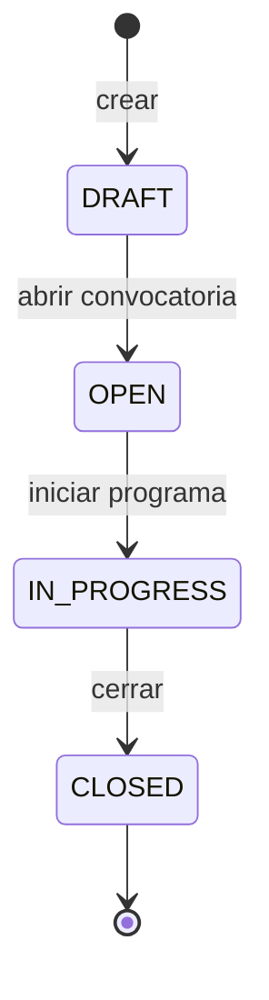
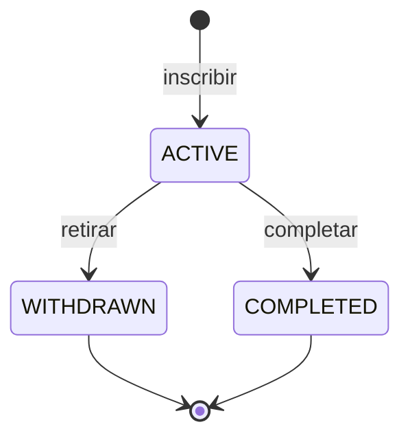
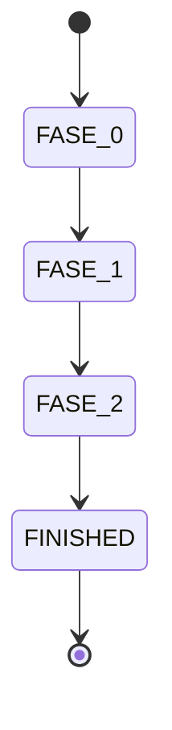
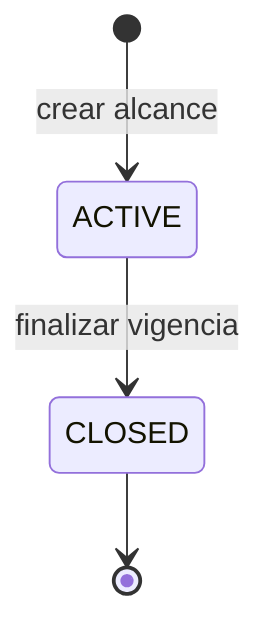
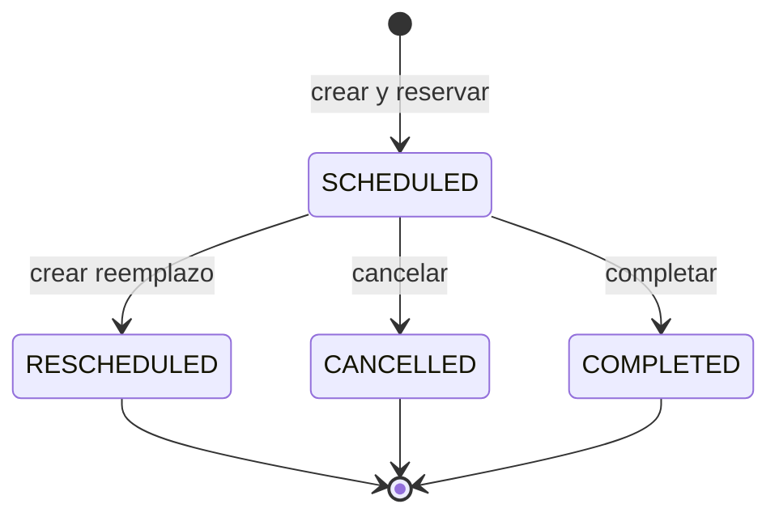
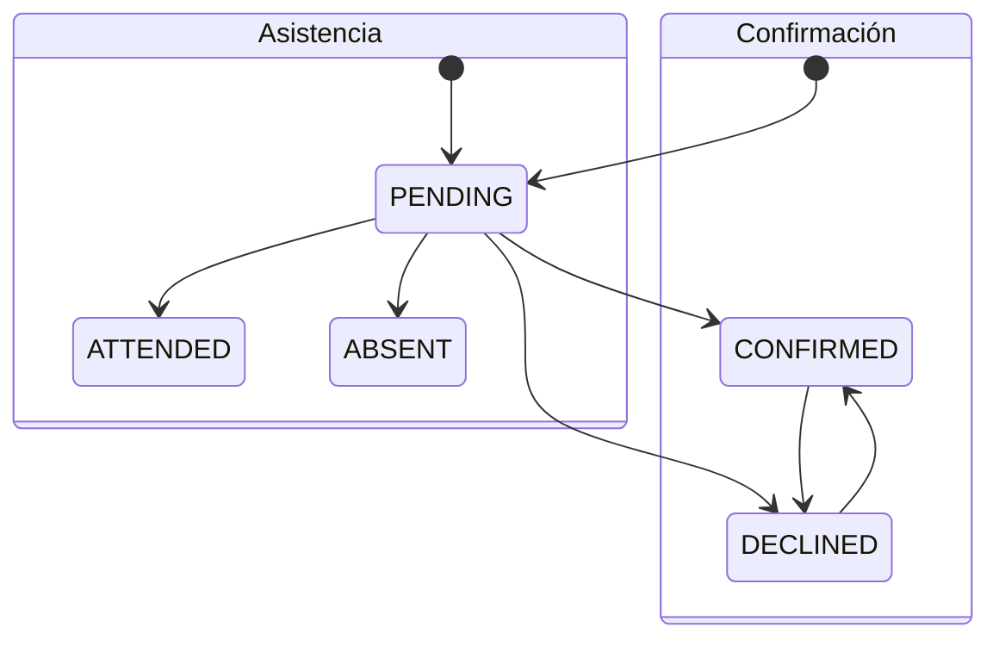
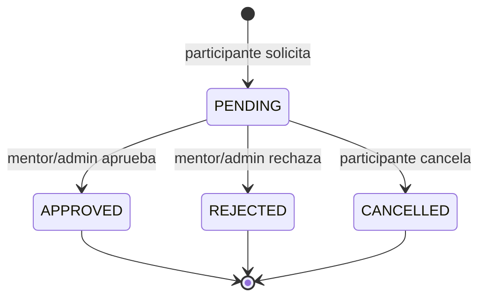
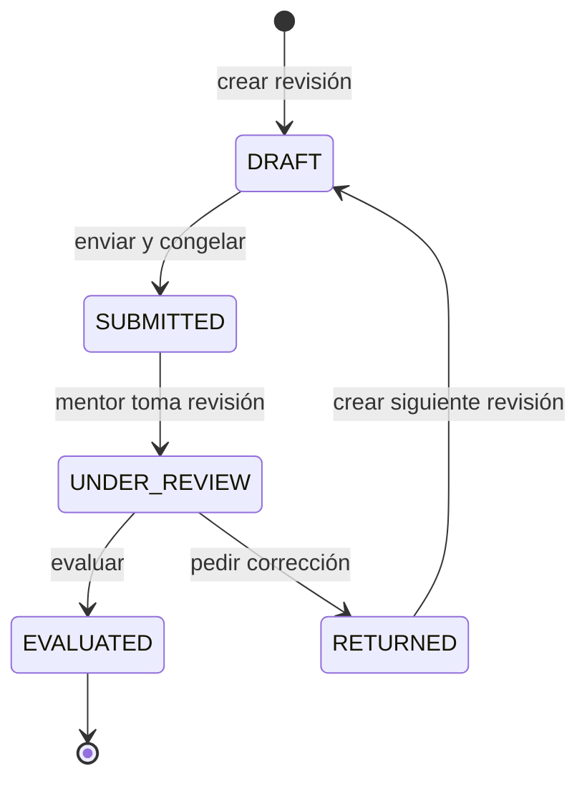
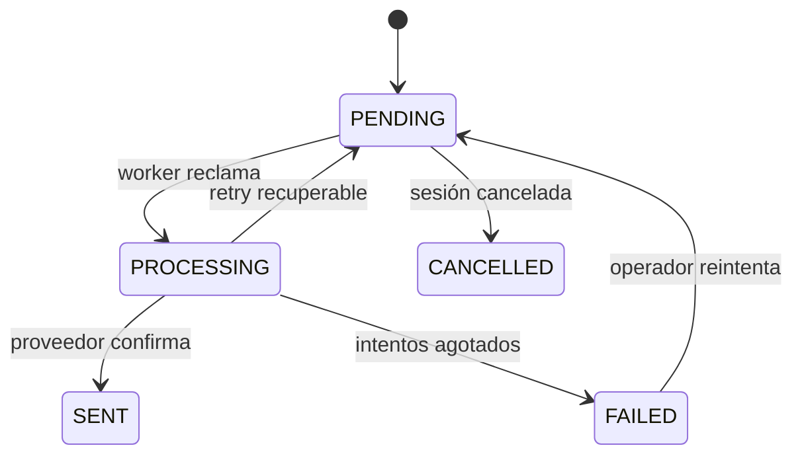

# 12 · Máquinas de estado e invariantes del dominio

Fecha: 2026-07-25
Contrato complementario de `02-modelo-datos.md` y `03-api-design.md`.

Una máquina de estados define qué transiciones existen, quién puede ejecutarlas y bajo qué condiciones. Los nombres visuales pueden cambiar; estas transiciones no cambian sin decisión de contrato.

## 0. Oleada

- Solo `ADMIN` transiciona una oleada y siempre dentro de su organización.
- No se permiten saltos ni retrocesos. Un patch sin cambio de estado puede editar datos mientras
  la oleada no esté `CLOSED`.
- `CLOSED` es de solo lectura; no se borra ni se reabre en el piloto.
- `capacity` nunca puede quedar por debajo de `activeEnrollmentCount`.
- Crear usa `Idempotency-Key`; editar usa `expectedVersion`.
- La edición de capacidad y la creación de enrollments bloquean la misma fila de oleada. Así ambos
  cambios se serializan y no pueden exceder el cupo.

## 1. Enrollment

Estado operativo:

Avance del programa:

- Solo `ADMIN` crea o actualiza enrollments y siempre dentro de su organización.
- La persona debe estar activa y tener rol `PARTICIPANT`.
- La oleada no puede estar `CLOSED`; el par persona/oleada es único.
- El alta bloquea la fila de oleada, cuenta enrollments `ACTIVE` y crea solo si hay capacidad.
- Fase y estado avanzan sin saltos ni retrocesos. `WITHDRAWN` y `COMPLETED` son terminales.
- `currentWeek` solo puede tener valor en `FASE_1`, entre 1 y 6. Al avanzar a `FASE_2` se limpia la
  semana y se fija `phase1GraduatedAt`.
- Crear usa `Idempotency-Key`; actualizar usa `expectedVersion`.
- Un fallo de negocio revierte también la reserva idempotente: después de liberar un cupo, el mismo
  request fallido puede reintentarse.

## 2. Mentor assignment

- Solo `ADMIN` crea o cierra asignaciones dentro de su organización.
- El mentor debe estar activo, tener rol `MENTOR`, perfil y capability `SPECIALIST`.
- `enrollmentId = null` significa alcance de oleada; un UUID limita el alcance a un enrollment
  `ACTIVE` de esa misma oleada.
- En el piloto existe una asignación activa por combinación
  `oleada + enrollmentId + capability`. Reasignar exige cerrar la vigente antes de crear otra.
- `ACTIVE|CLOSED` se deriva de `endsAt`; no se persiste otro estado que pueda contradecir la
  vigencia.
- Cerrar usa `DELETE` semántico, pero no borra: fija `endsAt`, incrementa `version` y audita
  before/after. Una asignación programada solo puede cerrarse después de `startsAt`.
- Crear bloquea la oleada para serializar carreras por el mismo alcance y usa `Idempotency-Key`;
  cerrar bloquea la asignación y exige `expectedVersion`.
- `PEER` puede existir como capability de perfil, pero no puede crearse como asignación en el
  piloto.

## 3. Sesión

| Transición | Actor | Precondiciones | Efectos atómicos |
|---|---|---|---|
| crear → `SCHEDULED` | Mentor asignado/Admin | fase válida, participantes válidos, sin traslapes | sesión + participantes + reservas + outbox |
| `SCHEDULED` → `COMPLETED` | Mentor de sesión/Admin | hora iniciada; `expectedVersion` vigente | estado + outbox + auditoría |
| `SCHEDULED` → `CANCELLED` | Mentor de sesión/Admin | `expectedVersion` vigente | liberar reservas + cancelar reminders + outbox |
| `SCHEDULED` → `RESCHEDULED` | Mentor/Admin | nuevo horario válido y libre | nueva sesión + nuevas reservas + liberar anteriores + enlazar historial + outbox |

Una reprogramación nunca edita silenciosamente el horario original. Crea un registro reemplazo y conserva trazabilidad.

## 4. Confirmación y asistencia

Son dos conceptos separados:

- Participante cambia su confirmación mientras la sesión esté `SCHEDULED` y `now < confirmationClosesAt`.
- Baseline del piloto: `confirmationClosesAt = startsAt`. Se persiste para auditar la regla aplicada y permitir una política configurable futura sin reinterpretar sesiones existentes.
- La API expone `confirmationClosesAt` y el booleano contextual `canConfirm`.
- Si el cliente intenta confirmar fuera de ventana, el estado no cambia y recibe `422 CONFIRMATION_CLOSED`.
- Mentor de la sesión/Admin registra asistencia; no el participante.
- Asistencia es terminal en el MVP. Una corrección administrativa excepcional se audita con before/after.
- `CONFIRMED` no implica `ATTENDED`; `DECLINED` tampoco debe convertirse automáticamente en `ABSENT`.

## 5. Solicitud de reprogramación

Invariantes:

1. quien solicita participa en la sesión;
2. la sesión continúa `SCHEDULED`;
3. solo una solicitud `PENDING` por participante/sesión;
4. aprobar requiere que la sesión original siga vigente;
5. aprobación y reprogramación son una transacción;
6. un conflicto de horario deja la solicitud pendiente y devuelve `409`; no hay aprobación parcial.

El `409 SCHEDULE_CONFLICT` identifica el recurso que colisiona y el intervalo ocupado. `conflictingSessionId` solo aparece si el actor ya tiene permiso para leer esa sesión; nunca se filtran título, mentor ni otros participantes de una sesión ajena.

## 6. Revisión de entregable

La flecha `RETURNED → DRAFT` crea otra fila con `revision_number + 1`; no recicla la anterior.

| Estado | Puede editar notas/archivos | Puede descargar | Acción válida principal |
|---|:---:|:---:|---|
| `DRAFT` | dueño | dueño | submit |
| `SUBMITTED` | no | dueño + mentor autorizado | start review |
| `UNDER_REVIEW` | no | dueño + reviewer | evaluate/return |
| `RETURNED` | no | dueño + reviewer | crear siguiente draft |
| `EVALUATED` | no | dueño + reviewer | consultar feedback |

Submit exige al menos un archivo o contenido aceptado por la consigna, todos los archivos `CLEAN`, deadline/regla de tardanza válida, ownership y versión vigentes.

## 7. Reminder y outbox

- El delivery es al menos una vez; la idempotencia evita efectos duplicados.
- `idempotency_key` es única por evento/canal/destinatario/ventana.
- Un lock con expiración recupera jobs abandonados en `PROCESSING`.
- n8n puede transportar el mensaje, pero no decidir si el evento existió.

## 8. Matriz de invariantes

| Invariante | DTO | Service/transacción | DB | Test mínimo |
|---|:---:|:---:|:---:|---|
| intervalo positivo | ✅ | ✅ | ✅ | boundary |
| fase/semana/checkpoint coherentes | ✅ | ✅ | ✅ | contract + migration |
| mentor/participante sin traslape | — | ✅ | ✅ | carrera concurrente |
| ownership | — | ✅ | FK/índices ayudan | suite negativa |
| una solicitud pendiente | — | ✅ | ✅ | carrera concurrente |
| revisión enviada inmutable | — | ✅ | permisos/trigger opcional | integración |
| score 0–100 | ✅ | ✅ | ✅ | boundary |
| máximo tres ranks únicos | ✅ | ✅ | ✅ | transacción concurrente |
| evento durable con mutación | — | ✅ | misma TX | rollback/integración |

La duplicación deliberada de una regla entre DTO, service y DB no es desperdicio: cada capa evita una clase diferente de fallo.

## 9. Regla para cambios futuros

Cambiar un estado requiere, como mínimo:

1. decisión registrada;
2. diagrama y tabla de transición actualizados;
3. migración compatible;
4. OpenAPI/tipos compartidos;
5. UI para estados loading/empty/error y el nuevo estado;
6. pruebas de transición válida, inválida y concurrente;
7. estrategia para registros ya existentes.
